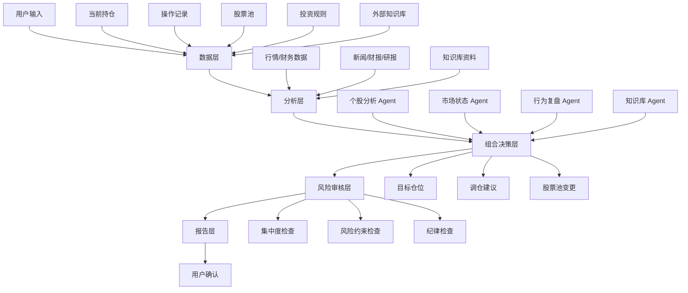
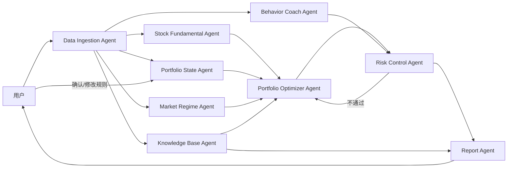

# 投资助理系统 MVP 实施计划 + PRD

> 版本：MVP 0.1  
> 定位：个人投资组合管理、持仓行为复盘、股票池研究、知识库辅助决策系统  
> 重要声明：本系统用于辅助研究、风险管理和决策复盘，不直接构成投资建议，不建议在 MVP 阶段接入自动交易。

---

## 1. 产品一句话定义

一个面向个人投资者的 AI 投资助理：持续读取你的持仓、股票池、操作记录、市场状态和投资知识库，帮助你做组合诊断、仓位管理、个股研究、调仓建议和投资行为复盘。

---

## 2. 核心目标

### 2.1 要解决的问题

1. **仓位结构不清晰**
   - 指数、个股、现金、防御资产比例是否合理？
   - 某个行业或主题是否过度集中？

2. **股票池动态管理困难**
   - 新增股票是否优于现有持仓？
   - 哪些股票应该从观察池升级为持仓？
   - 哪些股票基本面恶化，应降权或剔除？

3. **市场情绪影响操作**
   - 是否因为短期涨跌频繁交易？
   - 是否追高、恐慌卖出、过度集中？
   - 是否违反自己长期投资规则？

4. **投资经验无法沉淀**
   - 巴菲特、芒格、股东信、经典投资原则等知识无法稳定融入日常决策。
   - 自己的历史操作没有被系统性复盘。

5. **调仓决策缺少统一框架**
   - 缺少明确的“为什么买、为什么卖、买多少、何时复盘”的机制。

---

## 3. MVP 范围

### 3.1 MVP 必做功能

1. **持仓录入与管理**
   - 支持手动录入持仓。
   - 字段：ticker、名称、市场、行业、当前权重、成本、当前价格、持仓理由、买入日期。

2. **股票池管理**
   - 支持新增、移除、标记观察股票。
   - 支持股票状态：watch / candidate / hold / reduce / remove。

3. **组合诊断**
   - 计算指数仓位、个股仓位、现金仓位。
   - 计算行业集中度、单票集中度、前五大持仓集中度。
   - 输出组合健康评分。

4. **个股基本面分析**
   - 对股票池中的个股做标准化分析。
   - 输出质量、成长、估值、风险、护城河、综合评分。

5. **市场状态判断**
   - 判断当前市场：risk-on / neutral / risk-off / high-volatility。
   - 输出建议的指数、个股、现金比例。

6. **调仓建议生成**
   - 根据当前持仓、股票评分、市场状态和你的规则生成目标权重。
   - 输出加仓、减仓、观察、剔除建议。

7. **操作行为复盘**
   - 读取你的买卖记录。
   - 判断是否存在追涨杀跌、过度交易、无计划加仓、情绪化减仓。
   - 输出行为建议。

8. **投资知识库问答**
   - 将巴菲特股东信、芒格语录、经典投资书摘、你的笔记作为知识源。
   - 用于解释投资原则，不直接替代组合优化器。

9. **每周投资简报**
   - 输出本周组合变化、风险变化、股票池变化、建议动作和需要关注的问题。

### 3.2 MVP 暂不做

- 自动下单。
- 高频交易。
- 复杂量化预测模型。
- 日内交易建议。
- 完全自动替你买卖。
- 直接把 NotebookLM 当作核心策略数据库。

---

## 4. 用户画像

### 4.1 目标用户

个人投资者，主要做中长期投资，希望：

- 有指数底仓。
- 适当配置个股增强收益。
- 避免板块和单票过度集中。
- 通过复盘提高自己的投资纪律。
- 参考优秀投资者原则，但保留自己的判断。

### 4.2 核心使用场景

1. 每周查看组合健康状态。
2. 新加入一只股票时，判断是否值得进入股票池。
3. 市场剧烈波动时，判断是否需要提高指数或现金比例。
4. 每次操作后记录理由，之后复盘是否合理。
5. 用投资大师知识库检查自己的行为是否偏离长期主义。

---

## 5. 系统总体架构



---

## 6. 数据模型

### 6.1 Holding 当前持仓

| 字段 | 类型 | 说明 |
|---|---|---|
| ticker | string | 股票/ETF 代码 |
| name | string | 名称 |
| asset_type | enum | index / stock / cash / bond / other |
| sector | string | 行业 |
| theme | string | 主题，如 AI、消费、医药 |
| weight | number | 当前组合权重 |
| cost_basis | number | 成本 |
| current_price | number | 当前价格 |
| unrealized_pnl | number | 浮盈浮亏 |
| thesis | text | 持仓理由 |
| conviction | 1-5 | 主观信心等级 |
| last_reviewed_at | date | 上次复盘时间 |

### 6.2 StockAnalysis 个股分析结果

| 字段 | 类型 | 说明 |
|---|---|---|
| ticker | string | 股票代码 |
| quality_score | 0-100 | 质量评分 |
| growth_score | 0-100 | 成长评分 |
| valuation_score | 0-100 | 估值评分 |
| risk_score | 0-100 | 风险评分，越高风险越大 |
| moat_score | 0-100 | 护城河评分 |
| management_score | 0-100 | 管理层评分 |
| composite_score | 0-100 | 综合评分 |
| recommendation | enum | add / hold / reduce / watch / remove |
| key_thesis | text | 核心投资逻辑 |
| key_risks | list | 主要风险 |
| source_refs | list | 数据来源引用 |

### 6.3 PortfolioRule 投资规则

| 字段 | 默认值 | 说明 |
|---|---:|---|
| target_index_min | 30% | 指数 / ETF 目标仓位下限 |
| target_index_max | 50% | 指数 / ETF 目标仓位上限 |
| max_stock_weight | 70% | 个股总仓位上限 |
| max_single_stock_weight | 25% | 单只个股最高权重 |
| max_high_risk_single_stock_weight | 10% | 高风险单只个股最高权重 |
| max_sector_weight | 40% | 单一行业最高权重 |
| max_theme_weight | 40% | 单一主题最高权重 |
| max_turnover_per_rebalance | 15% | 单次调仓最大换手 |
| min_cash_weight | 0% | 最低现金比例 |
| review_frequency | weekly | 默认每周复盘 |

### 6.4 TradeLog 操作记录

| 字段 | 类型 | 说明 |
|---|---|---|
| trade_id | string | 操作 ID |
| date | date | 操作日期 |
| ticker | string | 标的 |
| action | enum | buy / sell / trim / add |
| weight_delta | number | 仓位变化 |
| reason | text | 当时操作理由 |
| emotion | enum | calm / fear / greed / fomo / panic / uncertain |
| plan_aligned | boolean | 是否符合计划 |
| post_review | text | 事后复盘 |

### 6.5 MarketRegime 市场状态

| 字段 | 类型 | 说明 |
|---|---|---|
| regime | enum | risk-on / neutral / risk-off / high-volatility |
| confidence | 0-100 | 判断置信度 |
| trend_score | 0-100 | 趋势分数 |
| volatility_score | 0-100 | 波动分数 |
| breadth_score | 0-100 | 市场宽度分数 |
| recommended_index_weight | number | 建议指数仓位 |
| recommended_stock_weight | number | 建议个股仓位 |
| recommended_cash_weight | number | 建议现金仓位 |

---

## 7. Agent 分工表

| Agent | 核心职责 | 输入 | 输出 | MVP 优先级 |
|---|---|---|---|---|
| Portfolio State Agent | 整理当前持仓和股票池 | 持仓、现金、股票池 | 标准化组合状态 | P0 |
| Stock Fundamental Agent | 分析个股基本面 | 财报、估值、新闻、行业信息 | 个股评分与报告 | P0 |
| Sector Exposure Agent | 判断行业/主题暴露 | 持仓、行业映射 | 行业集中度、超标提醒 | P0 |
| Market Regime Agent | 判断市场状态 | 指数、波动率、市场宽度、宏观信号 | risk-on/neutral/risk-off | P1 |
| Portfolio Optimizer Agent | 生成目标仓位 | 当前持仓、规则、个股评分、市场状态 | 目标仓位、调仓建议 | P0 |
| Risk Control Agent | 审核调仓方案 | 目标仓位、规则 | 风险警告、是否通过 | P0 |
| Behavior Coach Agent | 复盘用户操作行为 | 交易记录、持仓变化、市场环境 | 操作纪律建议 | P1 |
| Knowledge Base Agent | 调用投资大师知识库 | 巴菲特/芒格/书摘/用户笔记 | 原则解释、引用依据 | P1 |
| Report Agent | 生成简报 | 所有 agent 输出 | 每周报告、调仓说明 | P0 |
| Data Ingestion Agent | 数据采集与清洗 | API、CSV、手工录入 | 标准化数据 | P0 |

---

## 8. Agent 关系图



---

## 9. 核心决策逻辑

### 9.1 指数/个股动态配置

```text
if market_regime == risk_off:
    target_index_weight = 40% - 50%
    target_stock_weight = 30% - 60%
    target_cash_weight = 0% - 30%
elif market_regime == neutral:
    target_index_weight = 30% - 50%
    target_stock_weight = 50% - 70%
    target_cash_weight = 0% - 20%
elif market_regime == risk_on:
    target_index_weight = 30% - 40%
    target_stock_weight = 60% - 70%
    target_cash_weight = 0% - 10%
```

### 9.2 新股票加入逻辑

```text
if new_stock.composite_score > lowest_holding_score + 10
and new_stock.risk_score <= portfolio_average_risk
and sector_after_add <= max_sector_weight
then:
    add_to_candidate_list
    propose_weight = 2% - 5%
else:
    keep_in_watchlist
```

### 9.3 减仓逻辑

```text
if single_stock_weight > max_single_stock_weight:
    trim_to_limit

if sector_weight > max_sector_weight:
    reduce_lowest_score_stock_in_sector

if stock_score_drops_2_reviews_in_a_row:
    reduce_or_move_to_watch
```

### 9.4 行为复盘逻辑

```text
if trade_reason is empty:
    flag: unplanned_trade

if buy_after_large_short_term_rise and no_thesis_update:
    flag: possible_fomo

if sell_after_market_drop and fundamentals_unchanged:
    flag: possible_panic_sell

if turnover_this_month > rule.max_monthly_turnover:
    flag: overtrading
```

---

## 10. NotebookLM 的定位

### 10.1 适合做什么

NotebookLM 适合作为：

1. **投资知识库阅读器**
   - 上传巴菲特股东信、芒格演讲、经典书摘、研报、文章。

2. **带引用的问答工具**
   - 例如问：巴菲特如何看待市场波动？
   - 它可以基于上传资料回答，并给出处。

3. **学习材料生成器**
   - 生成 briefing doc、学习指南、音频概览、提纲。

4. **原则抽取工具**
   - 从资料中抽取投资原则，再同步到主知识库。

### 10.2 不适合做什么

NotebookLM 不适合作为：

1. 核心交易规则引擎。
2. 结构化持仓数据库。
3. 自动组合优化器。
4. 稳定的长期 API 后端。
5. 自动化调仓系统。

### 10.3 推荐用法

```text
NotebookLM = 投资经典资料阅读层
Obsidian/Notion = 投资原则沉淀层
Postgres/SQLite = 结构化组合数据库
Agent 系统 = 分析、推理、调仓建议层
```

推荐流程：

1. 将巴菲特股东信、芒格演讲、经典投资书籍笔记放入 NotebookLM。
2. 从 NotebookLM 中抽取原则，例如：
   - 不预测短期市场。
   - 买入优秀公司而不是便宜垃圾。
   - 保持安全边际。
   - 避免能力圈外投资。
3. 将这些原则整理成结构化规则，放入主知识库。
4. Behavior Coach Agent 和 Risk Control Agent 使用这些原则检查你的操作。

---

## 11. MVP 页面设计

### 11.1 Dashboard 首页

显示：

- 总资产概览。
- 当前指数/个股/现金比例。
- 风险等级。
- 组合健康评分。
- 本周最重要 3 条建议。

### 11.2 Portfolio 页面

显示：

- 当前持仓列表。
- 单票权重。
- 行业分布。
- 主题分布。
- 是否超出规则。

### 11.3 Watchlist 股票池页面

显示：

- 股票评分。
- 状态：观察/候选/持仓/减持/剔除。
- 最近分析时间。
- 加入理由。

### 11.4 Rebalance 调仓建议页面

显示：

- 当前权重。
- 建议目标权重。
- 建议动作。
- 调仓理由。
- 风险审核结果。

### 11.5 Behavior Coach 操作复盘页面

显示：

- 最近操作。
- 是否符合计划。
- 是否可能受情绪影响。
- 下次改进建议。

### 11.6 Knowledge 知识库页面

显示：

- 投资原则。
- 来源引用。
- 对当前组合的启发。

---

## 12. 技术实现建议

### 12.1 MVP 技术栈

- 前端：Next.js / React
- 后端：FastAPI / Python
- 数据库：SQLite 起步，后续迁移 Postgres
- 任务调度：Cron / APScheduler
- 数据处理：Pandas
- LLM 编排：Hermes Agent / LangGraph / 自研 agent router
- 知识库：Obsidian/Markdown + 向量库，可辅助 NotebookLM
- 可视化：Plotly / ECharts

### 12.2 数据源建议

MVP 可以先用：

- 手工 CSV / Google Sheet 录入持仓。
- yfinance 或其他行情 API 获取基础行情。
- 财报数据先半自动导入。
- 新闻/研报先作为辅助，不进入硬性决策。

### 12.3 后续可扩展

- 接入券商只读 API。
- 接入自动行情与财务数据。
- 接入向量数据库。
- 接入回测模块。
- 接入半自动下单。

---

## 13. 4 周实施计划

### Week 1：数据结构与组合诊断

目标：先让系统看懂你的持仓。

任务：

1. 定义 Holding、Stock、Rule、TradeLog 数据表。
2. 支持 CSV 导入当前持仓。
3. 支持手动维护股票池。
4. 实现组合集中度计算。
5. 实现基础 Dashboard。
6. 输出第一版组合健康报告。

交付物：

- 持仓管理页面。
- 股票池页面。
- 组合诊断报告。

### Week 2：个股分析与股票池评分

目标：系统能分析股票池质量。

任务：

1. 定义个股分析 prompt 和评分模板。
2. 实现 Stock Fundamental Agent。
3. 实现行业分类与板块暴露分析。
4. 为每只股票生成结构化分析结果。
5. 支持新增股票后自动进入分析流程。

交付物：

- 个股分析报告。
- 股票评分列表。
- 股票池变更建议。

### Week 3：组合优化与风险审核

目标：系统能生成目标仓位建议。

任务：

1. 定义投资规则配置。
2. 实现 Portfolio Optimizer Agent。
3. 实现 Risk Control Agent。
4. 根据评分和规则生成目标权重。
5. 输出加仓、减仓、观察、剔除建议。

交付物：

- 调仓建议页面。
- 风险审核报告。
- 目标仓位方案。

### Week 4：行为复盘与知识库接入

目标：系统开始帮你提高操盘纪律。

任务：

1. 定义操作记录格式。
2. 实现 TradeLog 输入。
3. 实现 Behavior Coach Agent。
4. 整理投资原则知识库。
5. 用巴菲特/芒格原则对操作做复盘。
6. 生成每周投资简报。

交付物：

- 操作复盘页面。
- 投资原则库。
- 每周投资简报。

---

## 14. 验收标准

MVP 成功标准：

1. 能导入当前持仓并展示仓位结构。
2. 能识别单票/行业集中度风险。
3. 能对股票池个股生成结构化分析。
4. 能根据规则生成目标仓位建议。
5. 能说明为什么建议加仓/减仓/观察/剔除。
6. 能对用户操作做行为复盘。
7. 能每周生成一份投资简报。
8. 所有建议都必须带有“依据”和“风险提示”。

---

## 15. 最小闭环

MVP 的最小闭环是：

```text
输入当前持仓 + 股票池 + 投资规则
→ 分析个股质量
→ 诊断组合集中度
→ 判断市场状态
→ 生成目标仓位
→ 风险审核
→ 输出调仓建议
→ 用户确认/拒绝
→ 记录操作
→ 下周复盘
```

---

## 16. 第一版已确认默认规则

```yaml
portfolio_rules:
  target_index_weight:
    neutral: [0.30, 0.50]
    risk_off: [0.40, 0.50]
    risk_on: [0.30, 0.40]
  max_stock_weight: 0.70
  max_single_stock_weight: 0.25
  max_high_risk_single_stock_weight: 0.10
  max_sector_weight: 0.40
  max_theme_weight: 0.40
  min_cash_weight: 0.00
  max_turnover_per_rebalance: 0.15
  review_frequency: weekly
  stock_score_thresholds:
    add_candidate: 75
    hold: 60
    reduce: 45
    remove: 35
```

---

## 17. 下一步建议

投资宪法的核心仓位参数已确认。下一步进入 MVP 落地：

1. 录入第一份真实持仓快照。
2. 将上述规则固化为机器可读配置。
3. 实现组合诊断：指数 / 个股 / 现金比例、单票集中度、行业 / 主题集中度。
4. 基于诊断结果输出第一版组合健康报告。
5. 再补充回撤阈值与再平衡频率。
